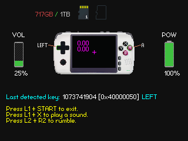

# pg2_test_go

Input and hardware test for PocketGo2 written in Go.

It is a remake of https://github.com/RafaVico/pg2_test
which is written in C++.

Some notes:

- I use SDL2 bindings for Go
- cross-compiling works on Linux, see build.sh
- there is a zip package for Windows and OPK for PocketGo2v2
- I only tested it on PocketGo2v2 and Windows 10
- volume indicator is available only on Windows*
- power button is not detected on PocketGo2v2

*getting volume on PocketGo2v2 is tricky and is in conflict with haptic (rumble). I chose rumble.

Some improvements compared to the original version:

- insert/eject of the sd card (righ slot) is detected dynamically
- ui reacts to both key presses and releases
- rumble works (it stopped working in the original program since SDL2 update)
- volume +/- buttons are detected (same regression in the original program)

See:

1. The original test program: https://github.com/RafaVico/pg2_test
2. Go-SDL2 bindings: https://github.com/veandco/go-sdl2
3. Firmware: https://github.com/Ninoh-FOX/POCKETGO2_ROGUE_CFW
4. Toolchain: https://github.com/Ninoh-FOX/toolchain
